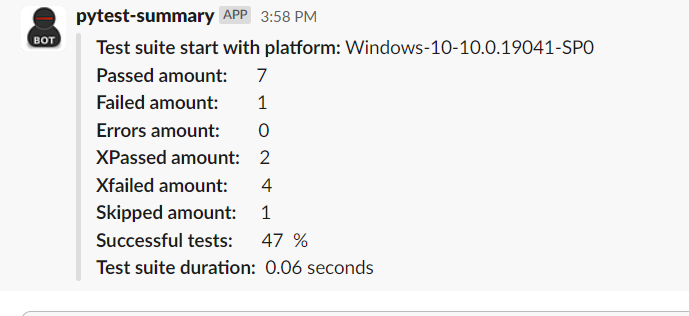
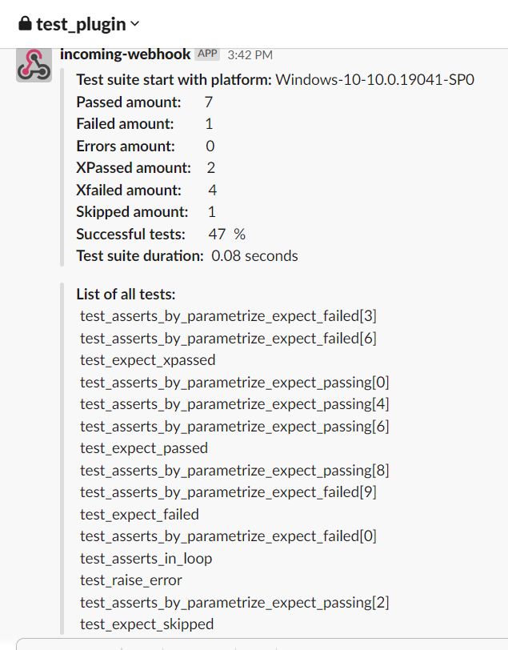
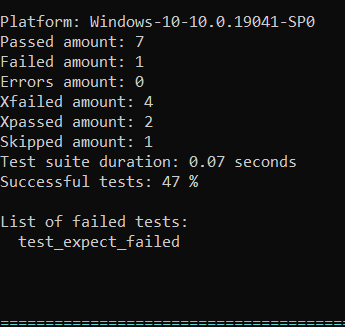
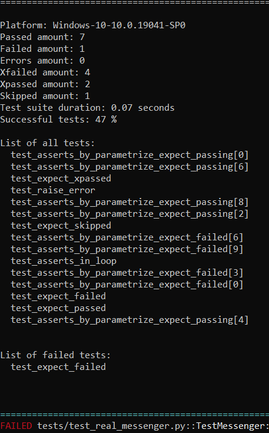

#### pytest-summary

A pytest plugin to send optional summary to messengers and printing optional summary of tests in the terminal.

#### Installation
> pip install pytest-summary


**Available pytest-summary options:**
```
--stdout_terminal_summary > True | False
 Printing summary in the terminal.

--stdout_terminal_all_tests > True | False
 Printing name of all tests in the terminal.
 
--stdout_terminal_failed_tests > True | False
 Printing name of failed tests in the terminal.
 
--stdout_terminal_error_tests > True | False
 Printing name of error tests in the terminal.
 
--ssl_verify > True | False
 Set the TLS certificate verification.
 
--slack_webhook_id > Incoming WebHooks type of string
 Send a Slack message of summary to a channel via a webhook.
 
--messenger_extra_template_of_failed_tests > True | False
 Add extra template of failed list tests to Slack message.
 
--messenger_extra_template_of_error_tests > True | False
 Add extra template of error list tests to Slack message.
 
--messenger_extra_template_of_all_tests > True | False
 Add extra template of all tests list tests to Slack message.
```

**Supported messengers:** `Slack`
    
**Short summary**



**Summary with failed list tests**
    



**Printing summary in the terminal**

**Short summary**


**Summary with failed list tests**


**Summary with all tests**

