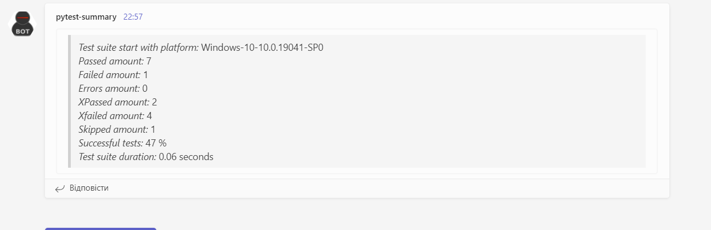

## pytest-summary

This pytest plugin allows you to send a summary of your tests to messengers,
as well as print a summary of the tests in the terminal.

The summary is optional and can be turned on or off as desired.

## Installation
```
pip install pytest-chic-report
```
**You need require plugin in a test module or a conftest.py**
```
pytest_plugins = ["pytest_chic_report.plugin"]
```


#### **The following options are available for the pytest-summary plugin:**
```
--terminal_short > True | False
 Printing summary in the terminal.

--terminal_all > True | False
 Printing name of all tests in the terminal.
 
--terminal_failed > True | False
 Printing name of failed tests in the terminal.
 
--terminal_errors > True | False
 Printing name of error tests in the terminal.
 
--ssl_verify > True | False
 Set the TLS certificate verification.
 
--slack_webhook > Incoming WebHooks type of string
 Send a Slack message of summary to a channel via a absolute path of webhook.
 
--teams_webhook > Incoming WebHooks type of string
 Send a Teams message of summary to a channel via a absolute path of webhook.
 
--messenger_failed > True | False
 Adding an additional template of failed list tests to the message.
 
--messenger_errors > True | False
 Adding an additional template of errors list tests to the message.
 
--messenger_all > True | False
 Adding an additional template of list tests to the message.
```
    
#### **Short summary in the Slack**


#### **Short summary in the Teams**



#### **Short summary in the terminal**


#### **The link to additional informations** [here](./docs/details.md)
